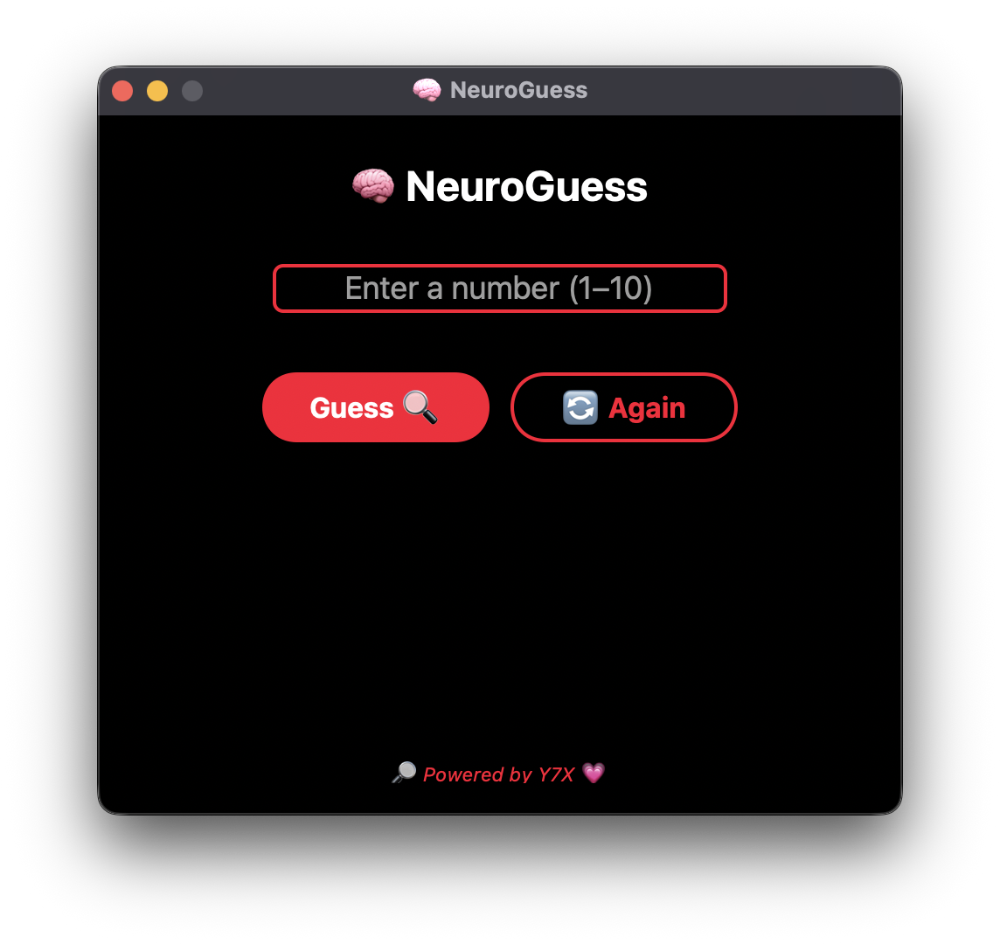

<div align="center">

# 🧠 NeuroGuess
**🧠 Neural ping-pong online – good luck guessing**

Can you outsmart the machine in just 3 tries?
A sleek number-guessing game with glowing vibes and a brainy twist.
Branded with 💗 by [Y7X-bit](https://github.com/Y7X-bit)



</div>

---

## 🌟 Features at a Glance

- 🔢 **1–10 guessing range** with only **3 chances**
- 🧠 Smart feedback with hints after each guess
- 🌑 AMOLED pitch black UI with glowing red accents
- 🧼 Clean, symmetric layout with centered logic
- 🔁 Reset anytime to challenge your intuition
- 🔎 **"Powered by Y7X 💗"** seal of flex

---

## 🖥️ Installation

> Python 3.9 or later required

```bash
git clone https://github.com/Y7X-bit/NeuroGuess.git
cd NeuroGuess
pip install -r requirements.txt
python NeuroGuess.py